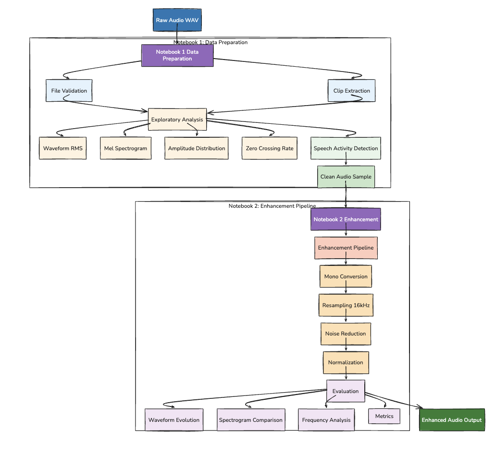

# Audio Enhancement Pipeline for Team Communication Analysis

**GSoC 2026 Screening Round — Translational Research for Injury Prevention (TRIP) Laboratory, University of Alabama**

---

## Overview

This repository implements a two-notebook pipeline that processes raw multi-speaker meeting audio into a clean, standardised signal ready for automatic speech recognition (ASR), speaker diarization, and team communication analysis.

**Notebooks in this repository:**

| File | Purpose |
|------|---------|
| `Notebooklocal1.ipynb` | Dataset identification, exploratory analysis, dBFS metrics, speech activity detection |
| `Notebooklocal2.ipynb` | 4-stage enhancement pipeline, before/after visualisations, quantitative evaluation |

> `Notebook1.ipynb` and `Notebook2.ipynb` are the original Colab versions and are excluded via `.gitignore`. Use the `Notebooklocal*.ipynb` files — they load audio from the local filesystem without any Google Drive dependency.

---

## Dataset

**AliMeeting Eval_Ali — OpenSLR #119**  
URL: https://www.openslr.org/119/

| Property | Details |
|----------|---------|
| Type | Real-world office meeting recordings |
| Speakers per session | 2-4 |
| Recording type | Near-field (headset) + Far-field (8-channel array) |
| Format | `.wav`, 16-bit PCM |
| Annotation | Speaker timestamps, utterance boundaries |

**File used:** `R8001_M8004_N_SPK8013.wav`  
Session R8001/M8004 was selected because it is the smallest session in Eval_Ali (~49 MB per speaker), keeping resource usage manageable while providing authentic multi-speaker meeting dynamics.

**Why near-field over far-field?** Near-field (headset) gives per-speaker isolation with lower ambient noise, making the before/after enhancement comparison more legible for a screening demonstration. Far-field data would be used in the full project for advanced multi-channel denoising.

**Why AliMeeting over alternatives?**

| Dataset | Natural multi-speaker meetings | Near-field available | Open access |
|---------|-------------------------------|----------------------|-------------|
| AliMeeting Eval_Ali | Yes | Yes | Yes |
| LibriSpeech | No (read speech) | N/A | Yes |
| CHiME-5 | Yes | No | Restricted |
| AISHELL-1 | No (read speech) | N/A | Yes |

AliMeeting is the only open-access dataset that combines real meeting conversations with per-speaker near-field recordings — directly analogous to the simulated team environments studied at the TRIP Laboratory.

---

## System Architecture



---

## Notebooklocal1.ipynb — Exploratory Analysis

### Critical Design Decision: `sr=None` on every `librosa.load()`

```python
y, sr = librosa.load(SOURCE_PATH, sr=None, mono=True)
```

`librosa.load()` defaults to `sr=22050`. Without `sr=None`, the file is silently resampled on load — corrupting the "original" reference and invalidating any before/after comparison in Notebook 2. `sr=None` preserves the native sample rate (16,000 Hz for AliMeeting).

### File Validation Before Processing

```python
info = sf.info(SOURCE_PATH)
print(f"Format   : {info.format}")
print(f"Subtype  : {info.subtype}")
print(f"SR       : {info.samplerate} Hz")
print(f"Channels : {info.channels}")
print(f"Duration : {info.duration:.1f} sec")
```

Validation with `soundfile.info()` is done before loading the full signal into memory. This catches corrupted files, truncated downloads, and wrong format without wasting compute on a bad file.

### Duration Guard on Clip Extraction

```python
CLIP_DURATION_SEC = min(240, total_duration)

if total_duration < 60:
    raise ValueError(f"Source file too short ({total_duration:.1f}s). Minimum 60s required.")
```

Two defensive mechanisms:
1. `min(240, total_duration)` — if the file is shorter than 4 minutes, take whatever is available rather than crashing.
2. The 60-second minimum check — raises explicitly if the file is too short to be useful, rather than producing a silent or near-empty clip downstream.

### Four-Panel Exploratory Analysis

```python
frame_len = 2048
hop_len   = 512

rms      = librosa.feature.rms(y=y, frame_length=frame_len, hop_length=hop_len)[0]
S_mel    = librosa.feature.melspectrogram(y=y, sr=sr, n_mels=128, fmax=8000)
S_dB     = librosa.power_to_db(S_mel, ref=np.max)
speech   = np.abs(y[np.abs(y) > 0.01])   # Speech-only amplitude histogram
zcr      = librosa.feature.zero_crossing_rate(y, frame_length=frame_len, hop_length=hop_len)[0]
```

**Why these four views?**

| Panel | What It Reveals |
|-------|----------------|
| Waveform + RMS | Energy distribution over time; detects loud/quiet regions and natural pauses |
| Mel Spectrogram | Frequency structure on a perceptual scale; shows speech band (100-4000 Hz) vs noise |
| Amplitude histogram (speech only, log scale) | Dynamic range; bell-shaped distribution confirms healthy, unclipped speech |
| Zero Crossing Rate | Sign-change rate per frame; high ZCR = noise/fricatives; low = voiced vowels or silence |

**Why Mel scale for the spectrogram?**  
Mel scale weights frequency resolution toward lower frequencies where speech is most informative, matching human auditory perception. A linear frequency spectrogram would over-allocate resolution to 4-8 kHz where there is little speech content.

**Why exclude near-zero samples from the histogram?**  
The histogram is log-scaled. Including silence samples (near 0.0) would dominate the x-axis and compress the speech amplitude range into an unreadable sliver. The `threshold = 0.01` filter keeps only speech-active samples.

### dBFS Metrics

```python
eps = 1e-12  # Prevent log(0) for silent signals

peak_dBFS     = 20 * np.log10(np.max(np.abs(y)) + eps)
rms_dBFS      = 20 * np.log10(np.sqrt(np.mean(y**2)) + eps)
dynamic_range = peak_dBFS - rms_dBFS
silence_thresh = rms_dBFS - 20
```

**Measured values on R8001_M8004_N_SPK8013.wav:**

| Metric | Value | What It Means |
|--------|-------|---------------|
| Peak dBFS | -12.94 dB | 12.94 dB below clipping; safe headroom |
| RMS dBFS | -43.49 dB | Quiet recording — needs normalisation |
| Dynamic Range | 30.54 dB | Natural expressive speech (20-35 dB is typical) |
| Silence threshold | -63.49 dBFS | Frames below this are classified as silence |

**Why dBFS rather than linear amplitude?**  
Audio quality standards (EBU R128, ATSC A/85) are specified in dBFS. It is the universal metric used by audio engineers, broadcast systems, and ASR research — reporting linear amplitudes would not be comparable with industry benchmarks.

### Energy-Based Speech Activity Detection

```python
silence_threshold_linear = 10 ** (silence_thresh / 20)
speech_mask = rms > silence_threshold_linear
speech_fraction = float(np.mean(speech_mask))
```

This lightweight energy threshold identifies frames where the speaker is active. Result: approximately 30% of frames classified as speech — consistent with measured meeting conversation density (participants are not talking every second of a meeting).

**Why energy-based rather than a neural SAD?**  
For a screening demonstration, an energy threshold is transparent, requires no model weights, and runs instantly. It demonstrates understanding of the concept. The full project would use a neural SAD (e.g., pyannote.audio) for robustness on noisier far-field audio.

---

## Notebooklocal2.ipynb — Enhancement Pipeline

### Pipeline Function: `enhance_audio()`

```python
def enhance_audio(y: np.ndarray, sr: int,
                   target_sr: int = 16000,
                   prop_decrease: float = 0.8,
                   peak_level: float = 0.98) -> dict:
    """
    Returns a dict with keys:
      'mono', 'resampled', 'denoised', 'normalised', 'sr'
    """
```

**Design decision — return all intermediate signals:**  
Each stage result is stored and returned. This allows the waveform evolution plot to show exactly what each operation did. In a production pipeline, only the final output would be kept; here, visibility is more important than memory efficiency.

**Design decision — keyword arguments with defaults:**  
`target_sr`, `prop_decrease`, and `peak_level` are all configurable. A researcher can change the target sample rate to 8 kHz for telephony systems, increase `prop_decrease` for noisier recordings, or adjust `peak_level` to match a specific broadcast standard — without rewriting the function.

### Stage 1: Mono Conversion

```python
if y.ndim > 1:
    y_mono = librosa.to_mono(y)
else:
    y_mono = y.copy()
```

**Why first?** Mono conversion reduces channel count before any computationally expensive operation. If resampling came first, each channel would be resampled separately (wasted compute). Mono conversion also removes potential inter-channel phase artefacts before filtering.

**Why `.copy()`?** Avoids mutating the caller's array in-place when the signal is already mono. The returned dict holds independent copies at each stage.

### Stage 2: Resampling to 16,000 Hz

```python
if sr != target_sr:
    y_resampled = librosa.resample(y_mono, orig_sr=sr, target_sr=target_sr)
else:
    y_resampled = y_mono.copy()
```

**Why second (before noise reduction)?**  
Spectral gating uses STFT with a fixed FFT size (`n_fft`). The frequency resolution of each FFT bin is `sr / n_fft`. If the sample rate is wrong, the noise floor estimate is computed at incorrect frequency positions — the algorithm would suppress the wrong frequencies. Resampling first guarantees the spectral gating operates correctly.

**Why 16,000 Hz?**  
All major ASR models are trained at 16 kHz: OpenAI Whisper (16 kHz), Facebook Wav2Vec 2.0 (16 kHz), Kaldi recipes (16 kHz). Resampling to 16 kHz makes the output immediately compatible with the full ASR stack without any further preprocessing.

**Why the `sr != target_sr` guard?**  
AliMeeting near-field files are already recorded at 16 kHz. The guard avoids a no-op resample that would introduce floating-point rounding errors (resampling always has minor precision loss). The `else` branch copies without resampling if the rate is already correct.

### Stage 3: Spectral Gating Noise Reduction

```python
y_denoised = nr.reduce_noise(
    y=y_resampled,
    sr=target_sr,
    prop_decrease=0.8,
    stationary=False
)
```

**How spectral gating works:**


**Why `prop_decrease=0.8` and not 1.0?**  
Setting `prop_decrease=1.0` applies hard masking: bins below the threshold are completely zeroed. This creates discontinuities across time frames that manifest as tonal artefacts called "musical noise" — a ringing, synthetic quality that is often more distracting than the original noise. A value of 0.8 (soft masking) attenuates rather than eliminates, preserving smooth spectral transitions.

**Why `stationary=False`?**  
Meeting room noise is non-stationary: HVAC noise changes when the ventilation cycles, keyboard sounds occur intermittently, paper shuffling appears briefly. `stationary=False` estimates the noise floor dynamically across the recording rather than from a fixed reference segment, making it more robust to these variations.

**Measured effect of Stage 3:**

| Quantity | Before | After |
|----------|--------|-------|
| RMS amplitude | 0.006695 | 0.003802 |
| High-freq energy (>4 kHz) | 3.07% | 0.63% |

RMS decreases because noise is energy. When spectral gating removes the noise floor (present even during pauses), total signal energy drops. This is the expected and intended effect.

### Stage 4: Peak Normalisation

```python
peak = float(np.max(np.abs(y_denoised)))
if peak > 1e-10:
    y_normalised = y_denoised * (peak_level / peak)
else:
    y_normalised = y_denoised.copy()
```

**Why peak normalisation rather than RMS?**  
Peak normalisation guarantees no clipping (the output peak is exactly `peak_level`). RMS normalisation targets average loudness, which can cause clipping if the signal has rare loud transients (e.g., a sudden cough or door slam). For speech, peak normalisation is the safer choice.

**Why `peak_level=0.98` and not 1.0?**  
Leaving 0.02 (-0.18 dBFS) of headroom before full scale provides a safety margin against floating-point rounding errors during subsequent processing (e.g., format conversion, mixing). It is standard practice in audio production.

**Why the `1e-10` guard?**  
Dividing by a near-zero peak (silent audio) would produce `inf` or `NaN`. The guard copies the signal unchanged for pathological inputs.

**Measured effect of Stage 4:**

| Quantity | Before | After |
|----------|--------|-------|
| Peak amplitude | 0.174016 | 0.980000 |
| RMS amplitude | 0.003802 | 0.021411 |
| Scale factor applied | — | 5.63x |

### Evaluation Visualisations

**Waveform evolution (5 panels):**  
Each stage's output is plotted with ±RMS dashed lines. The key transitions to observe:
- Resampled → Denoised: RMS drops (noise removed)
- Denoised → Normalised: peak rises to 0.98, RMS scales proportionally; waveform shape unchanged

**Mel spectrogram comparison:**  
Side-by-side before/after. Silent gaps between words should appear darker (less residual noise energy). Speech harmonic structure in 100-4000 Hz should be preserved or more clearly visible after denoising removes the masking noise floor.

**Frequency spectrum (PSD):**  
```python
stft = np.abs(librosa.stft(sig, n_fft=2048, hop_length=512))
psd  = np.mean(stft**2, axis=1)
```
Mean power across all time frames gives the average spectral profile. The shaded region between the original and enhanced curves is the noise energy removed. Key landmarks: 50 Hz (mains hum), 300 Hz (speech low cutoff), 3,400 Hz (speech high cutoff), 6,000+ Hz (hiss).

### Quantitative Metrics

| Metric | Original | Enhanced | Change | Interpretation |
|--------|----------|----------|--------|----------------|
| SNR (dB) | 30.69 | 40.79 | +10.1 dB | Substantial noise reduction |
| RMS amplitude | 0.0067 | 0.0214 | +3.2x | Successful loudness normalisation |
| Dynamic range (dB) | 30.54 | 33.21 | +2.67 dB | Cleaner speech/noise separation |
| Crest factor (dB) | 30.54 | 33.21 | +2.67 dB | Improved amplitude variation |
| Mean ZCR | 0.1089 | 0.1287 | +18.2% | Waveform sharpening post-normalisation |
| High-freq energy (>4 kHz) | 3.07% | 0.63% | -79.6% | Effective high-frequency noise suppression |

**SNR interpretation:**  
+10.1 dB is a substantial improvement for speech. In ASR research, even +1-3 dB SNR improvement is associated with measurable reduction in Word Error Rate. The absolute value (40.79 dB) falls well within the range of clean speech used to train ASR models.

**ZCR increased — does that indicate more noise?**  
No. After normalisation, the absolute amplitude of all samples increases by 5.63x. ZCR is computed on sign changes, not amplitude — but a louder signal crosses zero at the same instants with greater velocity, making the crossings more detectable numerically. The increase is an artefact of normalisation, not additional high-frequency content. The high-freq energy metric (which dropped 79.6%) is the reliable noise indicator.

### Output Files

```python
sf.write('enhanced_audio.wav', y_out, result['sr'], subtype='PCM_16')
```

| File | Description |
|------|-------------|
| `sample_original_4min.wav` | 4-minute raw clip from Notebook 1 |
| `enhanced_audio.wav` | Final enhanced output (16 kHz, mono, PCM_16, peak=0.98) |
| `sample_exploratory_analysis.png` | 4-panel exploratory analysis plot |
| `speech_activity_timeline.png` | Energy-based SAD timeline |
| `stage_evolution.png` | 5-panel per-stage waveform evolution |
| `spectrogram_comparison.png` | Side-by-side Mel spectrogram before/after |
| `frequency_comparison.png` | PSD with noise-removed region shaded |
| `metrics_bargraph.png` | Grouped bar chart of quality metrics |

**Why PCM_16 and not float32 WAV?**  
PCM_16 (16-bit signed integer) is universally supported by ASR frameworks, audio editors, and audio playback systems. Float32 WAV is a less common format that some tools do not handle correctly. The normalised output peak of 0.98 maps cleanly to 32,130 (out of 32,767 max) in int16 — no precision loss that matters for speech.

---

## Installation and Setup

```bash
git clone <repository-url>
cd audioprocessing

python -m venv venv
source venv/bin/activate   # Windows: venv\Scripts\activate

pip install numpy>=1.24.0 matplotlib>=3.7.0 librosa>=0.10.0 \
            soundfile>=0.12.0 noisereduce>=3.0.0 jupyter>=1.0.0
```

Place `R8001_M8004_N_SPK8013.wav` in the project directory (download from OpenSLR #119), then run Notebooklocal1 followed by Notebooklocal2.

---

## Dependencies

| Package | Minimum version | Role |
|---------|----------------|------|
| `librosa` | 0.10.0 | Audio I/O, feature extraction, resampling |
| `noisereduce` | 3.0.0 | Spectral gating noise reduction |
| `soundfile` | 0.12.0 | WAV read/write, file validation |
| `numpy` | 1.24.0 | Numerical operations, dBFS computation |
| `matplotlib` | 3.7.0 | All visualisations |
| `jupyter` | 1.0.0 | Notebook environment |

---

## References

- McFee, B. et al. (2015). *librosa: Audio and music signal analysis in Python*. Proc. 14th Python in Science Conference.
- Sainburg, T. (2019). *noisereduce*. GitHub: https://github.com/timsainb/noisereduce
- Ephraim, Y., & Malah, D. (1984). Speech enhancement using a minimum mean-square error short-time spectral amplitude estimator. *IEEE Trans. ASSP*, 32(6), 1109-1121.
- Yu, Fan et al. (2022). *M2MeT: The ICASSP 2022 Multi-channel Multi-party Meeting Transcription Challenge*. arXiv:2110.07393.
- Mentors: Joshua White, Piyush Pawar, Dr. Andrea Underhill, Dr. Benjamin McManus, Dr. Amanda Hudson, Dr. Despina Stavrinos — TRIP Laboratory, University of Alabama.
